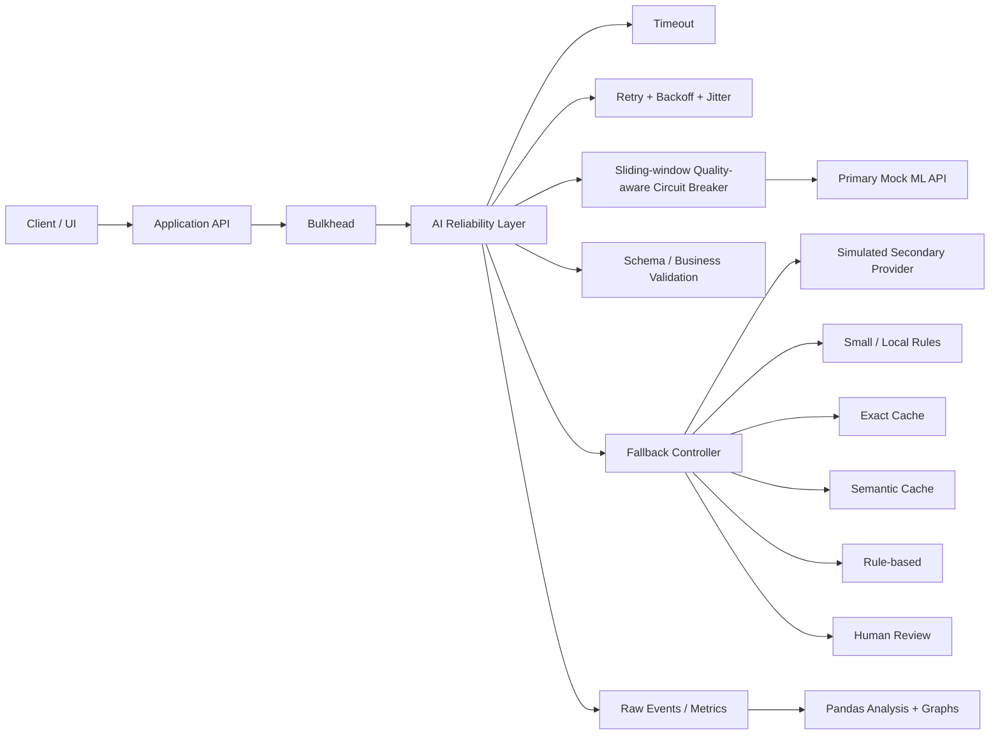

# Architecture

`app/service.py` เป็น Application API สำหรับสาธิต degraded-mode response และ bulkhead ส่วน `app/experiment.py` เรียก Reliability Layer โดยตรงเพื่อควบคุมการทดลอง A–D ทุกชั้น fallback ใน prototype เป็น deterministic simulation ไม่มี provider/model/cache ภายนอกจริง จึงใช้ศึกษา control flow และ trade-off ไม่ใช่ benchmark ความแม่นยำของ LLM จริง
