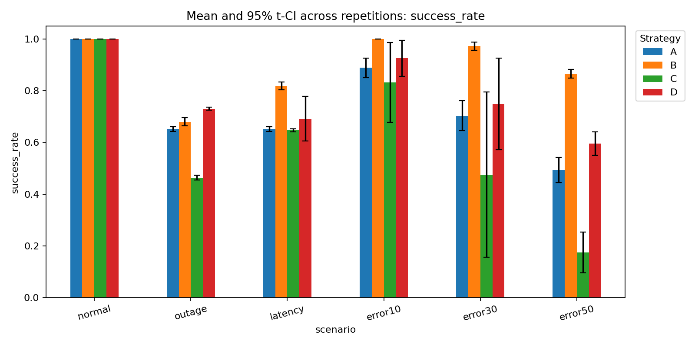
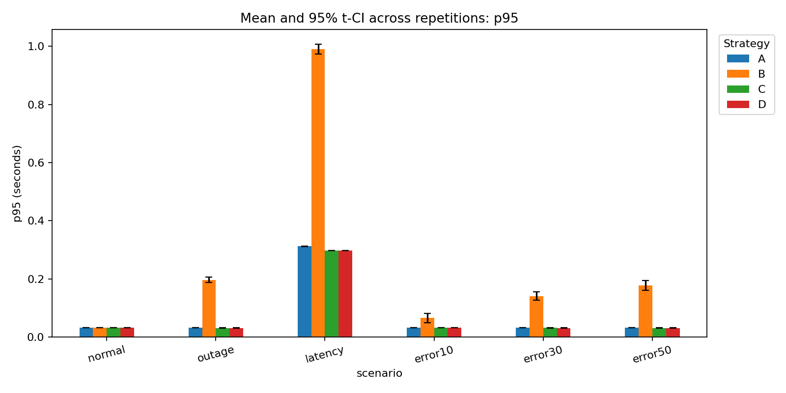
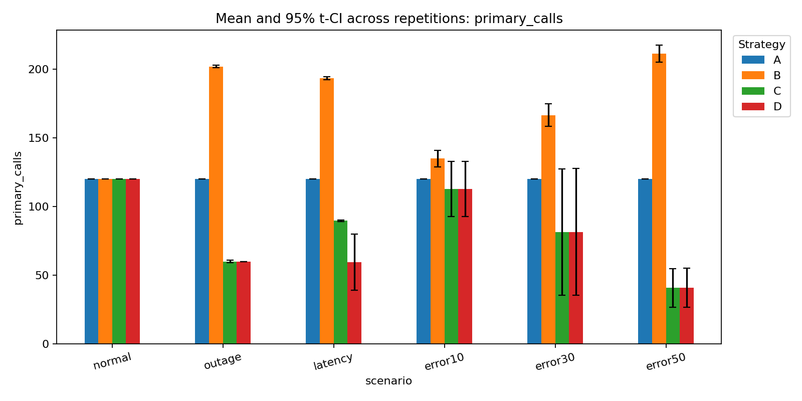
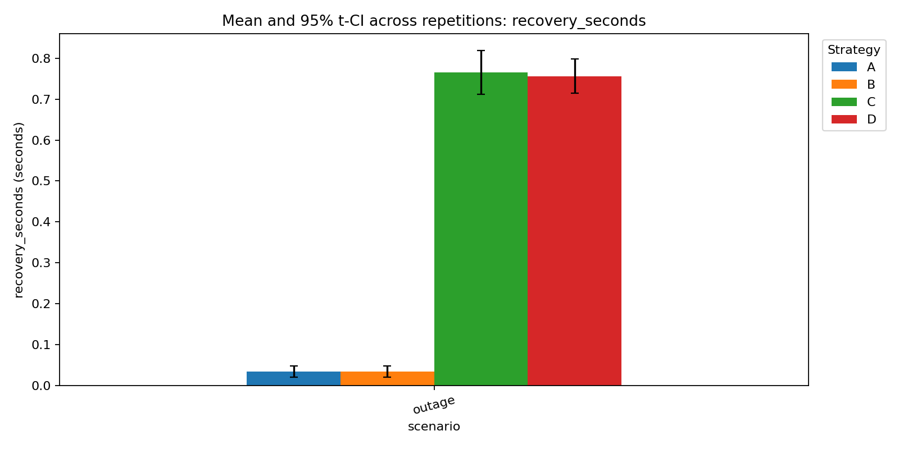
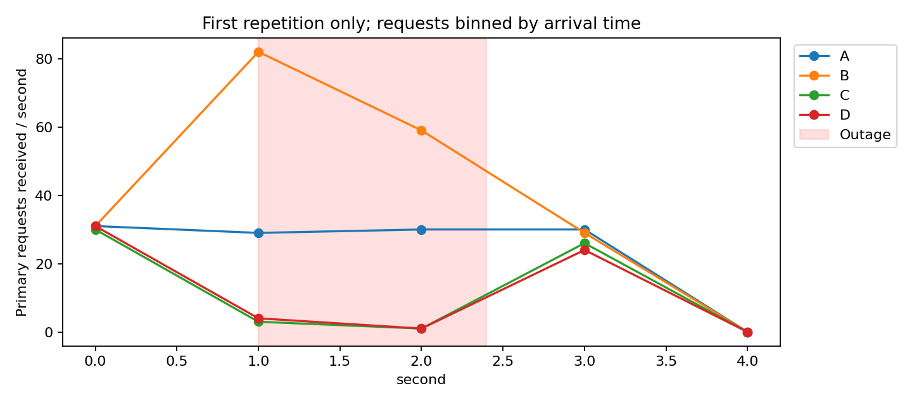

# บทที่ 6 Experiment & Evaluation

ผู้รับผิดชอบ: @chrisfoong และ นายเศรษฐวิทย์ ชัยรัตนานนท์ (@sxthawit)

## 6.1 วัตถุประสงค์และกลยุทธ์

ศึกษาว่า Circuit Breaker ร่วมกับ Fallback เปลี่ยนอัตราคำตอบที่ถูกต้อง เวลาในการตอบสนอง ภาระการเรียก API และต้นทุนสมมติอย่างไร เมื่อเทียบกับการเรียกครั้งเดียวและ Retry อย่างเดียว

| วิธี | พฤติกรรม |
| --- | --- |
| A | เรียก Primary ครั้งเดียว มี timeout ไม่มี retry |
| B | รวมไม่เกิน 3 attempts; exponential backoff 0.05 × 2^attempt วินาที คูณ jitter ระหว่าง 0–1 |
| C | Circuit Breaker: failure ติดต่อกัน 3 ครั้ง เปิด 1 วินาที แล้วอนุญาต probe 1 ครั้ง ไม่มี retry |
| D | เหมือน C และใช้ keyword fallback ถ้า Primary ใช้งานไม่ได้หรือวงจรเปิด |

ทุกวิธีใช้ deadline ต่อ attempt 0.3 วินาที และ connection pool สูงสุด 200 connections โดยไม่มี end-to-end SLA แยกต่างหากในรุ่นนี้ ค่า latency รวมเวลารอ retry และ fallback ภายใน request นั้น

## 6.2 สถานการณ์และวิธีดำเนินการ

ทดลอง 6 สถานการณ์: normal, outage, latency spike, error 10%, 30%, 50% กรณี error ใช้ HTTP 503 เท่านั้น โหมดปกติหน่วง 0.02 วินาที; spike หน่วง 0.8 วินาที ช่วง outage/spike เริ่มที่ 25% ของระยะเวลาทดลอง และกินเวลา 35% จึงกลับเป็นปกติที่ 60% ของระยะเวลาทดลอง ความล้มเหลวตัดสินจากเวลาที่ server รับ attempt

การรันนี้ใช้ 5 รอบต่อ strategy/scenario ระยะส่ง request รอบละ 4.0 วินาที อัตรา 30.0 requests/วินาที จึงมี 120 user requests ต่อชุด รวม 120 ชุด หรือ 14,400 user requests ไม่รวม warm-up และ retry

ก่อนแต่ละชุดยิง warm-up 5 ครั้งในโหมดปกติ แล้ว reset config, events และ breaker state ข้อมูล warm-up ไม่รวมใน metrics ใช้ Ticket จำลอง 12 ข้อที่ระบุ label ไว้และวนลำดับเดิมในทุกวิธี ระบบส่ง request ตามตารางเวลาโดยไม่รอ request ก่อนหน้าจบ จึงไม่ลด offered load เมื่อ strategy ตอบช้า บันทึก scheduler lag ไว้ตรวจข้อจำกัดของเครื่อง

ใช้ seed 42 ถึง 46; seed, request ID และ attempt เดียวกันให้ fault draw เดียวกัน ต่าง seed ระหว่างรอบ หมุนลำดับกลยุทธ์เพื่อลดอคติจากการรันวิธีเดิมก่อนทุกครั้ง rate ที่กำหนดเป็นความน่าจะเป็น สัดส่วนจริงในชุดเล็กอาจต่างจาก 10/30/50% และ strategy ที่ skip/retry จะเห็นชุด attempts ต่างกัน

Mock API และ runner รันเครื่องเดียวกัน worker เดียว ใช้ monotonic clock ร่วมกัน Python 3.11.9; platform: Windows-10-10.0.26200-SP0 รายละเอียดแพ็กเกจอยู่ใน environment.json และพารามิเตอร์อยู่ใน config.json

## 6.3 นิยาม Metrics

| Metric | นิยาม |
| --- | --- |
| Transport success | attempt ได้ HTTP 200 |
| Valid output | label ผ่าน Pydantic schema อยู่ใน billing/account/technical |
| User-visible success | คำตอบสุดท้ายตรง ground truth ÷ user requests ทั้งหมด |
| Primary/Fallback success | แยกแหล่งคำตอบถูกต้อง ใช้ user requests ทั้งหมดเป็นตัวหาร |
| p50/p95/p99 | quantile ของ latency ทุก user request รวมคำตอบล้มเหลวและ circuit rejection |
| success_p95 | p95 เฉพาะคำตอบถูกต้อง ใช้อ่านประกอบเพื่อไม่ให้ fast failure ดูดีเกินจริง |
| Recovery time | จาก outage สิ้นสุดถึง primary attempt ที่เริ่มหลัง outage และผ่าน validation สำเร็จครั้งแรก |
| Requests during outage | จำนวน attempts ที่ถึง server ภายใน outage ตาม server arrival log |
| Estimated cost/request | (จำนวน dispatched attempts × 0.001 + จำนวน fallback × 0) ÷ user requests |
| Fallback quality | accuracy, macro precision/recall/F1; human_review นับว่าไม่สำเร็จอัตโนมัติ |
| Circuit-open duration | รวมเวลาสถานะ open ระหว่างวัดผล ไม่รวม half-open |

ต้นทุนใช้หน่วยเงินสมมติ ไม่ใช่ราคาจริงของผู้ให้บริการและไม่ได้คำนวณ token Recovery ที่ไม่สังเกตพบหรือกรณีไม่มี fallback ใช้ N/A ไม่แทนด้วยศูนย์

คำนวณ metrics ต่อรอบก่อน แล้วรายงาน mean, sample SD และ 95% Student-t confidence interval ข้ามรอบใน summary.csv ไม่ถือว่า request ที่พึ่งพาสถานะ breaker แต่ละรายการเป็นตัวอย่างอิสระสำหรับ CI กรณีมีเพียงรอบเดียวไม่มี SD/CI ที่ใช้ได้ ช่วง CI ของสัดส่วนอาจออกนอก 0–1 จากวิธี t approximation

# บทที่ 7 Results & Discussion

ผลต่อไปนี้สร้างจาก raw data ในโฟลเดอร์เดียวกับรายงาน ไม่มีการเติมตัวเลขสมมติลงในผลการรัน

## 7.1 ความสำเร็จและ Latency

ตัวเลข success_rate เป็นสัดส่วน 0–1; latency เป็นวินาที ตารางเป็นค่าเฉลี่ยของ metric แต่ละรอบ ไม่ใช่ percentile จากการรวมทุก request เข้าด้วยกัน

| scenario | strategy | success_rate | p50 | p95 | p99 |
| --- | --- | --- | --- | --- | --- |
| error10 | A | 0.8883 | 0.0310 | 0.0320 | 0.0320 |
| error10 | B | 1.0000 | 0.0310 | 0.0659 | 0.1129 |
| error10 | C | 0.8317 | 0.0280 | 0.0320 | 0.0320 |
| error10 | D | 0.9250 | 0.0250 | 0.0320 | 0.0320 |
| error30 | A | 0.7033 | 0.0295 | 0.0320 | 0.0320 |
| error30 | B | 0.9717 | 0.0310 | 0.1414 | 0.1838 |
| error30 | C | 0.4750 | 0.0184 | 0.0318 | 0.0318 |
| error30 | D | 0.7483 | 0.0156 | 0.0314 | 0.0320 |
| error50 | A | 0.4933 | 0.0310 | 0.0320 | 0.0320 |
| error50 | B | 0.8650 | 0.0426 | 0.1784 | 0.2083 |
| error50 | C | 0.1750 | 0.0015 | 0.0314 | 0.0320 |
| error50 | D | 0.5950 | 0.0015 | 0.0312 | 0.0320 |
| latency | A | 0.6517 | 0.0310 | 0.3122 | 0.3130 |
| latency | B | 0.8183 | 0.0312 | 0.9911 | 1.0308 |
| latency | C | 0.6467 | 0.0160 | 0.2970 | 0.3095 |
| latency | D | 0.6917 | 0.0032 | 0.2970 | 0.3112 |
| normal | A | 1.0000 | 0.0280 | 0.0320 | 0.0320 |
| normal | B | 1.0000 | 0.0280 | 0.0320 | 0.0320 |
| normal | C | 1.0000 | 0.0280 | 0.0320 | 0.0320 |
| normal | D | 1.0000 | 0.0310 | 0.0320 | 0.0320 |
| outage | A | 0.6517 | 0.0220 | 0.0320 | 0.0320 |
| outage | B | 0.6800 | 0.0311 | 0.1972 | 0.2222 |
| outage | C | 0.4633 | 0.0075 | 0.0316 | 0.0320 |
| outage | D | 0.7300 | 0.0075 | 0.0314 | 0.0344 |

กราฟ p50.png และ p99.png แสดง percentile เพิ่มเติม; error bars แสดง CI ข้ามรอบ

## 7.2 ภาระ API การฟื้นตัว ต้นทุน และ Fallback

| scenario | strategy | primary_calls | requests_during_outage | recovery_seconds | estimated_cost_per_request | fallback_accuracy |
| --- | --- | --- | --- | --- | --- | --- |
| error10 | A | 120.0000 | 0.0000 | N/A | 0.0010 | N/A |
| error10 | B | 135.0000 | 0.0000 | N/A | 0.0011 | N/A |
| error10 | C | 112.8000 | 0.0000 | N/A | 0.0009 | N/A |
| error10 | D | 112.8000 | 0.0000 | N/A | 0.0009 | 0.5421 |
| error30 | A | 120.0000 | 0.0000 | N/A | 0.0010 | N/A |
| error30 | B | 166.6000 | 0.0000 | N/A | 0.0014 | N/A |
| error30 | C | 81.6000 | 0.0000 | N/A | 0.0007 | N/A |
| error30 | D | 81.6000 | 0.0000 | N/A | 0.0007 | 0.5389 |
| error50 | A | 120.0000 | 0.0000 | N/A | 0.0010 | N/A |
| error50 | B | 211.4000 | 0.0000 | N/A | 0.0018 | N/A |
| error50 | C | 40.8000 | 0.0000 | N/A | 0.0003 | N/A |
| error50 | D | 41.0000 | 0.0000 | N/A | 0.0003 | 0.5086 |
| latency | A | 120.0000 | 0.0000 | N/A | 0.0010 | N/A |
| latency | B | 193.4000 | 0.0000 | N/A | 0.0016 | N/A |
| latency | C | 89.8000 | 0.0000 | N/A | 0.0007 | N/A |
| latency | D | 59.6000 | 0.0000 | N/A | 0.0005 | 0.4940 |
| normal | A | 120.0000 | 0.0000 | N/A | 0.0010 | N/A |
| normal | B | 120.0000 | 0.0000 | N/A | 0.0010 | N/A |
| normal | C | 120.0000 | 0.0000 | N/A | 0.0010 | N/A |
| normal | D | 120.0000 | 0.0000 | N/A | 0.0010 | N/A |
| outage | A | 120.0000 | 41.8000 | 0.0344 | 0.0010 | N/A |
| outage | B | 202.0000 | 120.4000 | 0.0344 | 0.0017 | N/A |
| outage | C | 60.0000 | 4.4000 | 0.7656 | 0.0005 | N/A |
| outage | D | 60.0000 | 4.2000 | 0.7562 | 0.0005 | 0.4953 |

outage_timeline.png แสดงรอบแรกเพื่ออธิบายพฤติกรรมเท่านั้น ไม่ใช่ผลเฉลี่ยทุกรอบ ตาราง summary.csv เป็นข้อมูลสำหรับสรุปผลซ้ำ

## 7.3 คุณภาพ Fallback บนชุดคงที่

เมื่อทดสอบ Fallback บน Ticket ทั้ง 12 ข้อเดียวกัน ได้ accuracy 0.5000, macro precision 1.0000, macro recall 0.5000, macro-F1 0.6667 และ coverage 0.5000 รายละเอียดแต่ละข้ออยู่ใน fallback_fixed_set.csv

การประเมินชุดคงที่นี้ช่วยแยกความสามารถของกฎสำรองออกจากผลของ breaker ที่เลือกส่ง Ticket บางส่วนมาเข้า Fallback ขณะที่ fallback_accuracy ในตารางด้านบนวัดเฉพาะ Ticket ที่ใช้ Fallback จริงในแต่ละรอบ การส่ง human_review ยังไม่รวมเวลาทำงานของคนและไม่นับเป็นคำตอบอัตโนมัติสำเร็จ

## 7.4 Trade-offs จากผลที่สังเกต

- outage: B เรียก Primary เฉลี่ย 202.0 ครั้ง เทียบ A 120.0 ครั้ง; C เรียก 60.0 ครั้ง แต่ success rate เท่ากับ 0.463; D มี success rate 0.730 เทียบ C 0.463 และ p95 ของ D/B เท่ากับ 0.0314/0.1972 วินาทีตามลำดับ
- latency: B เรียก Primary เฉลี่ย 193.4 ครั้ง เทียบ A 120.0 ครั้ง; C เรียก 89.8 ครั้ง แต่ success rate เท่ากับ 0.647; D มี success rate 0.692 เทียบ C 0.647 และ p95 ของ D/B เท่ากับ 0.2970/0.9911 วินาทีตามลำดับ
- error50: B เรียก Primary เฉลี่ย 211.4 ครั้ง เทียบ A 120.0 ครั้ง; C เรียก 40.8 ครั้ง แต่ success rate เท่ากับ 0.175; D มี success rate 0.595 เทียบ C 0.175 และ p95 ของ D/B เท่ากับ 0.0312/0.1784 วินาทีตามลำดับ

Retry เพิ่มโอกาสผ่าน transient error แต่ใช้จำนวน attempts และเวลารอเพิ่ม Breaker อาจลดคำขอในช่วงล่มพร้อมกับปฏิเสธคำขอที่ยังพอสำเร็จได้ โดยเฉพาะ error แบบสุ่ม Fallback ให้ประโยชน์เท่าที่กฎสำรองครอบคลุม การตอบเร็วจากการปฏิเสธ request จึงไม่ใช่ความสำเร็จของผู้ใช้ ต้องอ่าน latency ควบคู่กับ success rate และคุณภาพเสมอ ผลเชิงพรรณนานี้ยังไม่ใช่การทดสอบนัยสำคัญทางสถิติระหว่างวิธี

## 7.5 ข้อจำกัดและงานต่อยอด

ใช้ API จำลองและ Ticket 12 ข้อ ไม่ใช่โมเดลจริง Primary ใช้ fixture lookup ที่ถูกต้องเสมอเมื่อบริการพร้อมเพื่อแยกผล service failure ออกจาก model quality; Fallback ใช้กฎบางส่วน ไม่ได้สร้าง ground truth ด้วยกฎเดียวกัน จึงห้ามอ้างว่าผลนี้เป็นความแม่นยำของ LLM จริง รอบทดลองสั้นและจำนวนตัวอย่าง tail latency จำกัด ควรเพิ่ม duration/repeats และใช้ข้อมูลจริงก่อนสรุปทั่วไป

ยังไม่จำลอง 429, malformed output หรือ drift ในชุด 6 scenarios นี้ ไม่มี secondary provider หรือ human review ที่ทำงานจริง ค่าใช้จ่ายเป็นสมมติ การแบ่ง success ตาม ground truth ทำได้ offline ในการทดลอง แต่ระบบ production อาจไม่มีคำตอบเฉลยใช้ตรวจทันที

ภาคผนวก: requests.json (ผลผู้ใช้), attempts.json (ทุกครั้งที่เรียก), server_events.jsonl (server arrival), runs.json (สถานะต่อชุด), metrics_per_run.csv, summary.csv, config.json, environment.json, tickets.json และ source code ใน app/
