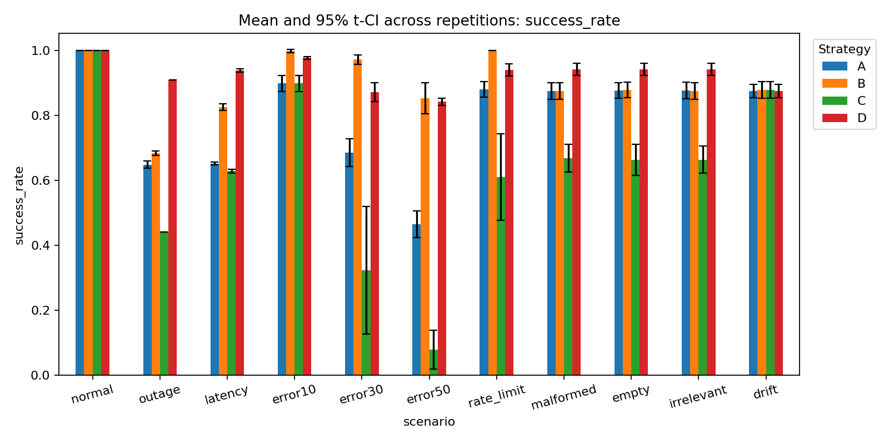
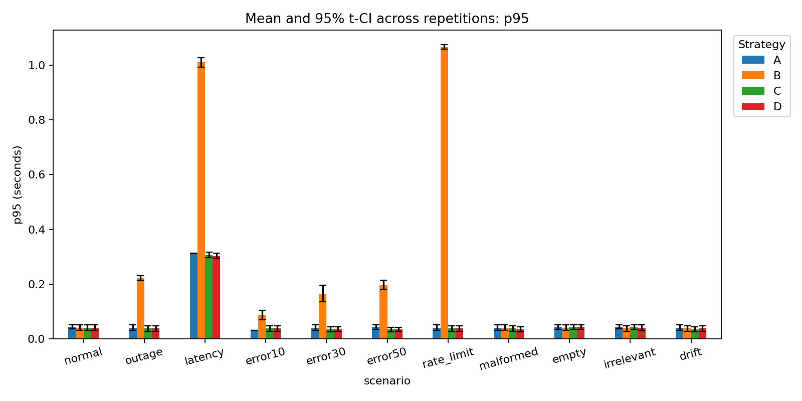
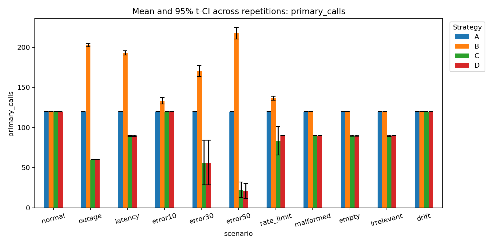
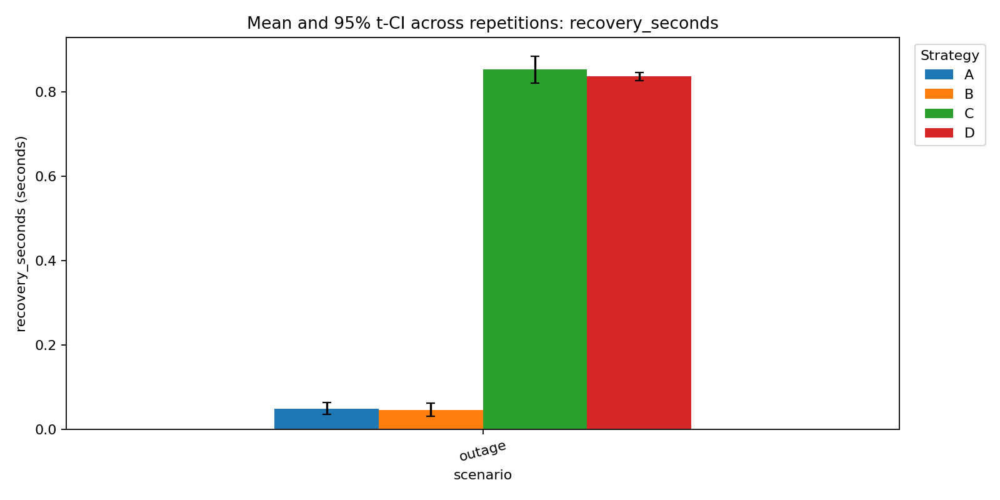
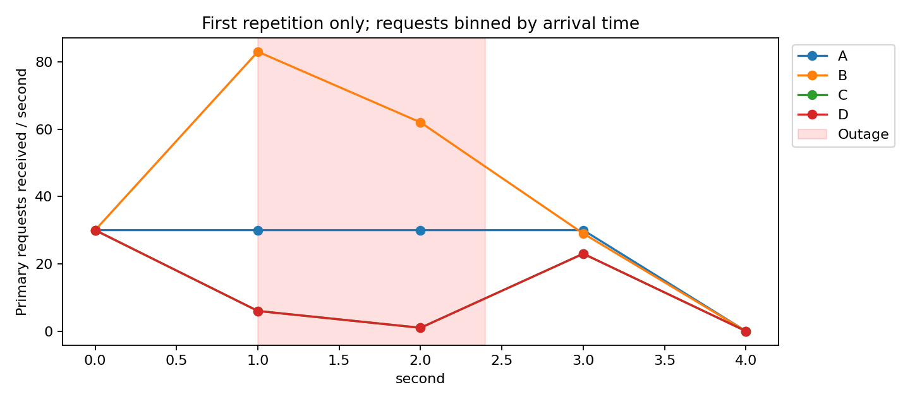

# บทที่ 6 Experiment & Evaluation

ผู้รับผิดชอบ: @chrisfoong และ นายเศรษฐวิทย์ ชัยรัตนานนท์ (@sxthawit)

## 6.1 วัตถุประสงค์และกลยุทธ์

ศึกษาว่า Circuit Breaker ร่วมกับ Fallback เปลี่ยนอัตราคำตอบที่ถูกต้อง เวลาในการตอบสนอง ภาระการเรียก API และต้นทุนสมมติอย่างไร เมื่อเทียบกับการเรียกครั้งเดียวและ Retry อย่างเดียว

| วิธี | พฤติกรรม |
| --- | --- |
| A | เรียก Primary ครั้งเดียว มี timeout ไม่มี retry |
| B | รวมไม่เกิน 3 attempts; exponential backoff 0.05 × 2^attempt วินาที คูณ jitter ระหว่าง 0–1 |
| C | Quality-aware Circuit Breaker: sliding window 10 calls, minimum 5 calls, เปิดเมื่อ failure rate ≥ 50%, cooldown 1 วินาที และอนุญาต half-open probe 1 ครั้ง |
| D | เหมือน C และใช้ fallback hierarchy เมื่อ Primary ใช้งานไม่ได้หรือวงจรเปิด |

ทุกวิธีใช้ deadline ต่อ attempt 0.3 วินาที และ connection pool สูงสุด 200 connections โดยไม่มี end-to-end SLA แยกต่างหากในรุ่นนี้ ค่า latency รวมเวลารอ retry และ fallback ภายใน request นั้น

## 6.2 สถานการณ์และวิธีดำเนินการ

ทดลอง 11 สถานการณ์: normal, outage, latency spike, HTTP 503 error 10/30/50%, HTTP 429 rate limit, malformed JSON, empty output, irrelevant label และ silent drift โหมดปกติหน่วง 0.02 วินาที; spike หน่วง 0.8 วินาที ช่วง outage, latency และ soft/silent failures เริ่มที่ 25% ของระยะเวลาทดลองและกินเวลา 35% จึงกลับเป็นปกติที่ 60% ของระยะเวลาทดลอง

การรันนี้ใช้ 5 รอบต่อ strategy/scenario ระยะส่ง request รอบละ 4.0 วินาที อัตรา 30.0 requests/วินาที จึงมี 120 user requests ต่อชุด รวม 220 ชุด หรือ 26,400 user requests ไม่รวม warm-up และ retry

ก่อนแต่ละชุดยิง warm-up 5 ครั้งในโหมดปกติ แล้ว reset config, events และ breaker state ข้อมูล warm-up ไม่รวมใน metrics ใช้ Ticket จำลอง 12 ข้อที่ระบุ label ไว้และวนลำดับเดิมในทุกวิธี ระบบส่ง request ตามตารางเวลาโดยไม่รอ request ก่อนหน้าจบ จึงไม่ลด offered load เมื่อ strategy ตอบช้า บันทึก scheduler lag ไว้ตรวจข้อจำกัดของเครื่อง

ใช้ seed 42 ถึง 46; seed, request ID และ attempt เดียวกันให้ fault draw เดียวกัน ต่าง seed ระหว่างรอบ หมุนลำดับกลยุทธ์เพื่อลดอคติจากการรันวิธีเดิมก่อนทุกครั้ง rate ที่กำหนดเป็นความน่าจะเป็น สัดส่วนจริงในชุดเล็กอาจต่างจาก 10/30/50% และ strategy ที่ skip/retry จะเห็นชุด attempts ต่างกัน

Mock API และ runner รันเครื่องเดียวกัน worker เดียว ใช้ monotonic clock ร่วมกัน Python 3.11.9; platform: Windows-10-10.0.26200-SP0 รายละเอียดแพ็กเกจอยู่ใน environment.json และพารามิเตอร์อยู่ใน config.json

## 6.3 นิยาม Metrics

| Metric | นิยาม |
| --- | --- |
| Transport success | attempt ได้ HTTP 200 |
| Valid output | label ผ่าน Pydantic schema อยู่ใน billing/account/technical |
| User-visible success | คำตอบสุดท้ายตรง ground truth ÷ user requests ทั้งหมด |
| Primary/Fallback success | แยกแหล่งคำตอบถูกต้อง ใช้ user requests ทั้งหมดเป็นตัวหาร |
| p50/p95/p99 | quantile ของ latency ทุก user request รวมคำตอบล้มเหลวและ circuit rejection |
| success_p95 | p95 เฉพาะคำตอบถูกต้อง ใช้อ่านประกอบเพื่อไม่ให้ fast failure ดูดีเกินจริง |
| Recovery time | จาก outage สิ้นสุดถึง primary attempt ที่เริ่มหลัง outage และผ่าน validation สำเร็จครั้งแรก |
| Requests during outage | จำนวน attempts ที่ถึง server ภายใน outage ตาม server arrival log |
| Estimated cost/request | (จำนวน dispatched attempts × 0.001 + จำนวน fallback × 0) ÷ user requests |
| Fallback quality | accuracy, macro precision/recall/F1; human_review นับว่าไม่สำเร็จอัตโนมัติ |
| Failure taxonomy count | จำนวน fault แต่ละประเภทจาก server log แยก scenario และ strategy |
| Circuit-open duration | รวมเวลาสถานะ open ระหว่างวัดผล ไม่รวม half-open |

ต้นทุนใช้หน่วยเงินสมมติ ไม่ใช่ราคาจริงของผู้ให้บริการและไม่ได้คำนวณ token Recovery ที่ไม่สังเกตพบหรือกรณีไม่มี fallback ใช้ N/A ไม่แทนด้วยศูนย์

คำนวณ metrics ต่อรอบก่อน แล้วรายงาน mean, sample SD และ 95% Student-t confidence interval ข้ามรอบใน summary.csv ไม่ถือว่า request ที่พึ่งพาสถานะ breaker แต่ละรายการเป็นตัวอย่างอิสระสำหรับ CI กรณีมีเพียงรอบเดียวไม่มี SD/CI ที่ใช้ได้ ช่วง CI ของสัดส่วนอาจออกนอก 0–1 จากวิธี t approximation

# บทที่ 7 Results & Discussion

ผลต่อไปนี้สร้างจาก raw data ในโฟลเดอร์เดียวกับรายงาน ไม่มีการเติมตัวเลขสมมติลงในผลการรัน

## 7.1 ความสำเร็จและ Latency

ตัวเลข success_rate เป็นสัดส่วน 0–1; latency เป็นวินาที ตารางเป็นค่าเฉลี่ยของ metric แต่ละรอบ ไม่ใช่ percentile จากการรวมทุก request เข้าด้วยกัน

| scenario | strategy | success_rate | p50 | p95 | p99 |
| --- | --- | --- | --- | --- | --- |
| drift | A | 0.8750 | 0.0310 | 0.0408 | 0.0410 |
| drift | B | 0.8783 | 0.0310 | 0.0380 | 0.0410 |
| drift | C | 0.8783 | 0.0310 | 0.0350 | 0.0410 |
| drift | D | 0.8750 | 0.0310 | 0.0381 | 0.0434 |
| empty | A | 0.8767 | 0.0310 | 0.0440 | 0.0440 |
| empty | B | 0.8783 | 0.0310 | 0.0412 | 0.0440 |
| empty | C | 0.6633 | 0.0310 | 0.0438 | 0.0464 |
| empty | D | 0.9417 | 0.0310 | 0.0440 | 0.0470 |
| error10 | A | 0.8983 | 0.0310 | 0.0320 | 0.0320 |
| error10 | B | 0.9983 | 0.0310 | 0.0876 | 0.1134 |
| error10 | C | 0.8983 | 0.0310 | 0.0380 | 0.0380 |
| error10 | D | 0.9767 | 0.0310 | 0.0381 | 0.0434 |
| error30 | A | 0.6850 | 0.0310 | 0.0410 | 0.0410 |
| error30 | B | 0.9717 | 0.0318 | 0.1658 | 0.1996 |
| error30 | C | 0.3233 | 0.0092 | 0.0350 | 0.0350 |
| error30 | D | 0.8717 | 0.0124 | 0.0353 | 0.0434 |
| error50 | A | 0.4650 | 0.0310 | 0.0440 | 0.0440 |
| error50 | B | 0.8533 | 0.0624 | 0.1978 | 0.2240 |
| error50 | C | 0.0783 | 0.0000 | 0.0342 | 0.0429 |
| error50 | D | 0.8417 | 0.0000 | 0.0348 | 0.0470 |
| irrelevant | A | 0.8767 | 0.0310 | 0.0441 | 0.0470 |
| irrelevant | B | 0.8750 | 0.0310 | 0.0380 | 0.0434 |
| irrelevant | C | 0.6633 | 0.0310 | 0.0436 | 0.0470 |
| irrelevant | D | 0.9417 | 0.0310 | 0.0410 | 0.0410 |
| latency | A | 0.6517 | 0.0318 | 0.3126 | 0.3130 |
| latency | B | 0.8250 | 0.0320 | 1.0099 | 1.0531 |
| latency | C | 0.6283 | 0.0310 | 0.3060 | 0.3147 |
| latency | D | 0.9383 | 0.0310 | 0.3030 | 0.3120 |
| malformed | A | 0.8750 | 0.0310 | 0.0410 | 0.0410 |
| malformed | B | 0.8750 | 0.0310 | 0.0410 | 0.0440 |
| malformed | C | 0.6683 | 0.0310 | 0.0380 | 0.0380 |
| malformed | D | 0.9417 | 0.0310 | 0.0350 | 0.0410 |
| normal | A | 1.0000 | 0.0310 | 0.0441 | 0.0470 |
| normal | B | 1.0000 | 0.0310 | 0.0410 | 0.0470 |
| normal | C | 1.0000 | 0.0310 | 0.0411 | 0.0440 |
| normal | D | 1.0000 | 0.0310 | 0.0411 | 0.0440 |
| outage | A | 0.6483 | 0.0310 | 0.0410 | 0.0410 |
| outage | B | 0.6833 | 0.0320 | 0.2220 | 0.2494 |
| outage | C | 0.4417 | 0.0123 | 0.0380 | 0.0380 |
| outage | D | 0.9083 | 0.0140 | 0.0380 | 0.0410 |
| rate_limit | A | 0.8800 | 0.0310 | 0.0408 | 0.0440 |
| rate_limit | B | 1.0000 | 0.0310 | 1.0660 | 1.6528 |
| rate_limit | C | 0.6100 | 0.0248 | 0.0380 | 0.0440 |
| rate_limit | D | 0.9400 | 0.0310 | 0.0378 | 0.0440 |

กราฟ p50.png และ p99.png แสดง percentile เพิ่มเติม; error bars แสดง CI ข้ามรอบ

## 7.2 ภาระ API การฟื้นตัว ต้นทุน และ Fallback

| scenario | strategy | primary_calls | requests_during_outage | recovery_seconds | estimated_cost_per_request | fallback_accuracy |
| --- | --- | --- | --- | --- | --- | --- |
| drift | A | 120.0000 | 0.0000 | N/A | 0.0010 | N/A |
| drift | B | 120.0000 | 0.0000 | N/A | 0.0010 | N/A |
| drift | C | 120.0000 | 0.0000 | N/A | 0.0010 | N/A |
| drift | D | 120.0000 | 0.0000 | N/A | 0.0010 | N/A |
| empty | A | 120.0000 | 0.0000 | N/A | 0.0010 | N/A |
| empty | B | 120.0000 | 0.0000 | N/A | 0.0010 | N/A |
| empty | C | 89.8000 | 0.0000 | N/A | 0.0007 | N/A |
| empty | D | 89.8000 | 0.0000 | N/A | 0.0007 | 0.8273 |
| error10 | A | 120.0000 | 0.0000 | N/A | 0.0010 | N/A |
| error10 | B | 133.4000 | 0.0000 | N/A | 0.0011 | N/A |
| error10 | C | 120.0000 | 0.0000 | N/A | 0.0010 | N/A |
| error10 | D | 120.0000 | 0.0000 | N/A | 0.0010 | 0.7626 |
| error30 | A | 120.0000 | 0.0000 | N/A | 0.0010 | N/A |
| error30 | B | 170.4000 | 0.0000 | N/A | 0.0014 | N/A |
| error30 | C | 56.4000 | 0.0000 | N/A | 0.0005 | N/A |
| error30 | D | 56.4000 | 0.0000 | N/A | 0.0005 | 0.8056 |
| error50 | A | 120.0000 | 0.0000 | N/A | 0.0010 | N/A |
| error50 | B | 217.4000 | 0.0000 | N/A | 0.0018 | N/A |
| error50 | C | 22.6000 | 0.0000 | N/A | 0.0002 | N/A |
| error50 | D | 21.2000 | 0.0000 | N/A | 0.0002 | 0.8293 |
| irrelevant | A | 120.0000 | 0.0000 | N/A | 0.0010 | N/A |
| irrelevant | B | 120.0000 | 0.0000 | N/A | 0.0010 | N/A |
| irrelevant | C | 89.6000 | 0.0000 | N/A | 0.0007 | N/A |
| irrelevant | D | 90.0000 | 0.0000 | N/A | 0.0008 | 0.8273 |
| latency | A | 120.0000 | 0.0000 | N/A | 0.0010 | N/A |
| latency | B | 193.0000 | 0.0000 | N/A | 0.0016 | N/A |
| latency | C | 89.4000 | 0.0000 | N/A | 0.0007 | N/A |
| latency | D | 89.6000 | 0.0000 | N/A | 0.0007 | 0.8347 |
| malformed | A | 120.0000 | 0.0000 | N/A | 0.0010 | N/A |
| malformed | B | 120.0000 | 0.0000 | N/A | 0.0010 | N/A |
| malformed | C | 90.0000 | 0.0000 | N/A | 0.0008 | N/A |
| malformed | D | 90.0000 | 0.0000 | N/A | 0.0008 | 0.8256 |
| normal | A | 120.0000 | 0.0000 | N/A | 0.0010 | N/A |
| normal | B | 120.0000 | 0.0000 | N/A | 0.0010 | N/A |
| normal | C | 120.0000 | 0.0000 | N/A | 0.0010 | N/A |
| normal | D | 120.0000 | 0.0000 | N/A | 0.0010 | N/A |
| outage | A | 120.0000 | 42.2000 | 0.0500 | 0.0010 | N/A |
| outage | B | 202.4000 | 120.4000 | 0.0468 | 0.0017 | N/A |
| outage | C | 60.0000 | 7.0000 | 0.8532 | 0.0005 | N/A |
| outage | D | 60.0000 | 7.0000 | 0.8374 | 0.0005 | 0.8358 |
| rate_limit | A | 120.0000 | 0.0000 | N/A | 0.0010 | N/A |
| rate_limit | B | 136.6000 | 0.0000 | N/A | 0.0011 | N/A |
| rate_limit | C | 83.6000 | 0.0000 | N/A | 0.0007 | N/A |
| rate_limit | D | 90.0000 | 0.0000 | N/A | 0.0008 | 0.8224 |

outage_timeline.png แสดงรอบแรกเพื่ออธิบายพฤติกรรมเท่านั้น ไม่ใช่ผลเฉลี่ยทุกรอบ ตาราง summary.csv เป็นข้อมูลสำหรับสรุปผลซ้ำ

## 7.3 คุณภาพ Fallback บนชุดคงที่

เมื่อทดสอบ fallback hierarchy (secondary provider จำลอง → small/local rules → exact cache → semantic cache → rule-based → human review) บน Ticket ทั้ง 12 ข้อเดียวกัน ได้ accuracy 0.8333, macro precision 1.0000, macro recall 0.8333, macro-F1 0.9048 และ coverage 0.8333 รายละเอียดแต่ละข้อและ tier ที่ใช้จริงอยู่ใน fallback_fixed_set.csv

การประเมินชุดคงที่นี้ช่วยแยกความสามารถของกฎสำรองออกจากผลของ breaker ที่เลือกส่ง Ticket บางส่วนมาเข้า Fallback ขณะที่ fallback_accuracy ในตารางด้านบนวัดเฉพาะ Ticket ที่ใช้ Fallback จริงในแต่ละรอบ การส่ง human_review ยังไม่รวมเวลาทำงานของคนและไม่นับเป็นคำตอบอัตโนมัติสำเร็จ

## 7.4 Trade-offs จากผลที่สังเกต

- outage: B เรียก Primary เฉลี่ย 202.4 ครั้ง เทียบ A 120.0 ครั้ง; C เรียก 60.0 ครั้ง แต่ success rate เท่ากับ 0.442; D มี success rate 0.908 เทียบ C 0.442 และ p95 ของ D/B เท่ากับ 0.0380/0.2220 วินาทีตามลำดับ
- latency: B เรียก Primary เฉลี่ย 193.0 ครั้ง เทียบ A 120.0 ครั้ง; C เรียก 89.4 ครั้ง แต่ success rate เท่ากับ 0.628; D มี success rate 0.938 เทียบ C 0.628 และ p95 ของ D/B เท่ากับ 0.3030/1.0099 วินาทีตามลำดับ
- error50: B เรียก Primary เฉลี่ย 217.4 ครั้ง เทียบ A 120.0 ครั้ง; C เรียก 22.6 ครั้ง แต่ success rate เท่ากับ 0.078; D มี success rate 0.842 เทียบ C 0.078 และ p95 ของ D/B เท่ากับ 0.0348/0.1978 วินาทีตามลำดับ
- rate_limit: B เรียก Primary เฉลี่ย 136.6 ครั้ง เทียบ A 120.0 ครั้ง; C เรียก 83.6 ครั้ง แต่ success rate เท่ากับ 0.610; D มี success rate 0.940 เทียบ C 0.610 และ p95 ของ D/B เท่ากับ 0.0378/1.0660 วินาทีตามลำดับ
- malformed: B เรียก Primary เฉลี่ย 120.0 ครั้ง เทียบ A 120.0 ครั้ง; C เรียก 90.0 ครั้ง แต่ success rate เท่ากับ 0.668; D มี success rate 0.942 เทียบ C 0.668 และ p95 ของ D/B เท่ากับ 0.0350/0.0410 วินาทีตามลำดับ
- drift: B เรียก Primary เฉลี่ย 120.0 ครั้ง เทียบ A 120.0 ครั้ง; C เรียก 120.0 ครั้ง แต่ success rate เท่ากับ 0.878; D มี success rate 0.875 เทียบ C 0.878 และ p95 ของ D/B เท่ากับ 0.0381/0.0380 วินาทีตามลำดับ

Retry เพิ่มโอกาสผ่าน transient error แต่ใช้จำนวน attempts และเวลารอเพิ่ม Breaker อาจลดคำขอในช่วงล่มพร้อมกับปฏิเสธคำขอที่ยังพอสำเร็จได้ โดยเฉพาะ error แบบสุ่ม Fallback ให้ประโยชน์เท่าที่กฎสำรองครอบคลุม การตอบเร็วจากการปฏิเสธ request จึงไม่ใช่ความสำเร็จของผู้ใช้ ต้องอ่าน latency ควบคู่กับ success rate และคุณภาพเสมอ ผลเชิงพรรณนานี้ยังไม่ใช่การทดสอบนัยสำคัญทางสถิติระหว่างวิธี

## 7.5 ข้อจำกัดและงานต่อยอด

ใช้ API จำลองและ Ticket 12 ข้อ ไม่ใช่โมเดลจริง Primary ใช้ fixture lookup ที่ถูกต้องเสมอเมื่อบริการพร้อมเพื่อแยกผล service failure ออกจาก model quality; Fallback ใช้กฎบางส่วน ไม่ได้สร้าง ground truth ด้วยกฎเดียวกัน จึงห้ามอ้างว่าผลนี้เป็นความแม่นยำของ LLM จริง รอบทดลองสั้นและจำนวนตัวอย่าง tail latency จำกัด ควรเพิ่ม duration/repeats และใช้ข้อมูลจริงก่อนสรุปทั่วไป

Secondary provider, local model, cache และ semantic cache ใน prototype เป็น deterministic simulation ไม่ใช่บริการหรือโมเดลจริง ส่วน human review เป็นสถานะส่งต่อและยังไม่มีเจ้าหน้าที่ทำงานจริง Silent drift ส่ง label ที่ถูก schema แต่ผิด ground truth จึงตรวจได้เฉพาะ offline evaluation ในต้นแบบ ไม่ถูกเปิด breaker ระหว่างให้บริการ ค่าใช้จ่ายเป็นสมมติและระบบ production อาจไม่มี ground truth ตรวจทันที

ภาคผนวก: requests.json, attempts.json, server_events.jsonl, runs.json, metrics_per_run.csv, summary.csv, failure_taxonomy_counts.csv, config.json, environment.json, tickets.json, ARCHITECTURE.md และ source code ใน app/
